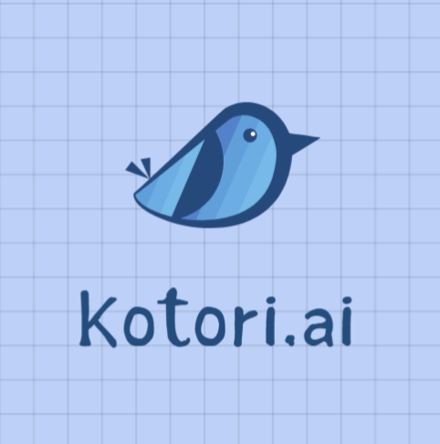

# Kotori.ai 🐦 – A Chatbot for Empty Nest Syndrome Support  

Kotori.ai is an **AI-powered chatbot** designed to help individuals navigate **Empty Nest Syndrome (ENS)** by providing relevant insights, coping strategies, and support. Built using **Streamlit**, **LangChain**, and **Ollama LLM**, it retrieves and generates responses using a **Retrieval-Augmented Generation (RAG) model**.  

---

## 🚀 Features  

✅ **Conversational AI** – Ask Kotori about **Empty Nest Syndrome**, its symptoms, and coping strategies.  
✅ **Retrieval-Augmented Generation (RAG)** – Combines **pre-existing knowledge** with **LLM-generated insights**.  
✅ **Personalized Responses** – Stores **chat history** for a smoother conversation experience.  
✅ **Streamlit UI** – Clean, **responsive, and user-friendly** interface.  
✅ **Chat History Management** – Allows users to **view or clear past conversations**.  
✅ **Bullet Point Formatting** – Ensures **structured and readable** responses.  

---

## 🛠 Tech Stack  

- **Python 3.9+**  
- **Streamlit** – Frontend for chatbot interaction  
- **LangChain** – RAG-based document retrieval  
- **ChromaDB** – Vector database for storing embeddings  
- **Ollama LLM (Gemma2:2b)** – AI model for responses  

---

## 🎬 Demo Screenshot  
  
---

## 📥 Installation & Setup  

### 1️⃣ Clone the Repository  
```bash
git clone https://github.com/your-username/kotori-ai.git
cd kotori-ai
```

### 2️⃣ Install Dependencies
```bash
pip install -r requirements.txt
```

### 3️⃣ Run the Chatbot
```bash
streamlit run app.py
```
---

## 📌 How It Works  

### 🔹 1. User Input Handling (`app.py`)  
- Accepts queries from users via **Streamlit’s input box**.  
- Handles greetings like **"Hi Kotori", "Hey"** with predefined responses.  

### 🔹 2. Query Processing (`querydata2.py`)  
- Checks if the input is a **greeting** → Returns an appropriate response.  
- If not, it **retrieves relevant documents** from **ChromaDB** using **similarity search**.  
- If no documents are found, it prompts the AI to **generate a response**.  
- Responses are structured with **bullet points & bold text**.  

### 🔹 3. Vector Embeddings (`embeddings.py`)  
- Uses **Ollama’s Gemma2:2b model** to **embed documents**.  
- Converts text into **vector representations** for **efficient retrieval**.  

### 🔹 4. Document Management (`filldata.py`)  
- Loads **PDF documents** from the `/data` directory.  
- Splits documents into **chunks** (800 tokens each).  
- Assigns **unique IDs** to prevent duplicate storage.  
- Stores processed text in **ChromaDB**.
---

### 🔍 Example Queries

💬 User: What are the symptoms of Empty Nest Syndrome?  
🤖 Kotori.ai:  
- Loneliness and loss: Experiencing sadness, anxiety, or depression.  
- Psychological distress: Strong emotional reactions to family changes.  
- Sociological impact: Changes in parental identity and social roles.

---
### 🛠 Future Improvements
- **Multi-document Retrieval** – Support for more ENS-related resources.
- **Memory Enhancement** – Long-term conversational memory.
- **UI Improvements** – Dark mode & mobile-friendly design.
---
### 🤝 Contributing
Contributions are welcome! If you have ideas or improvements:

- Fork this repository
- Create a new branch
- Submit a pull request

-------

